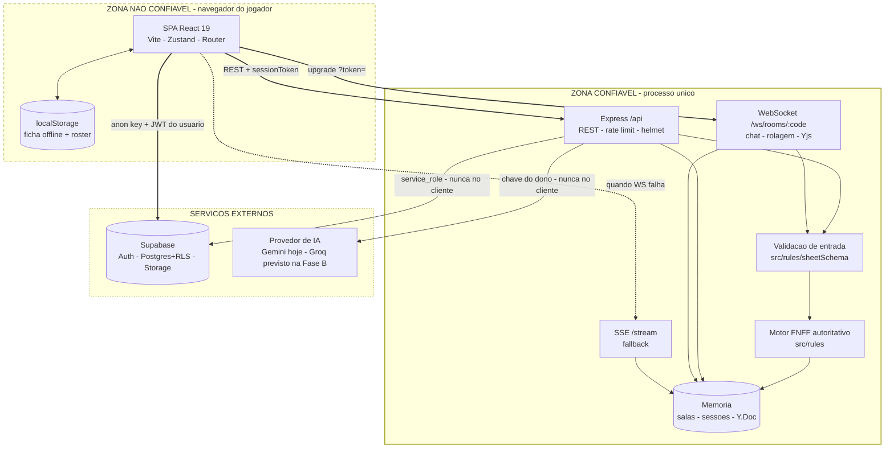
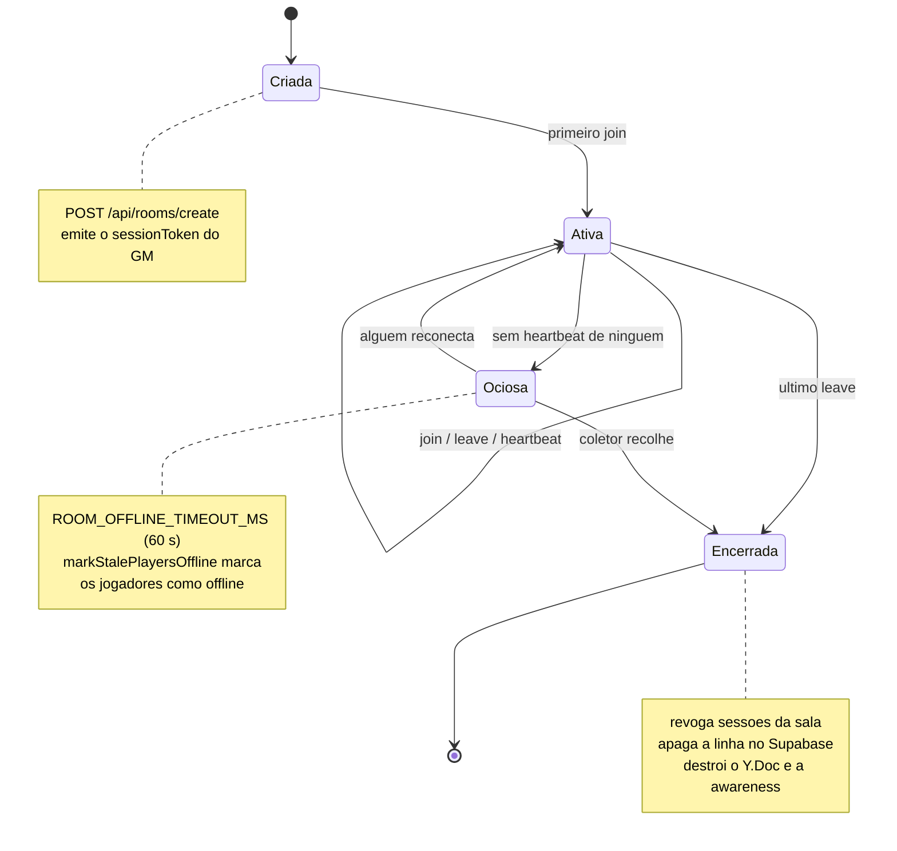
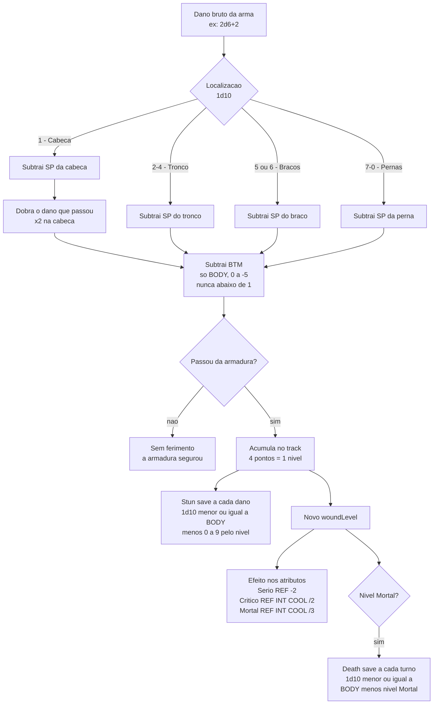
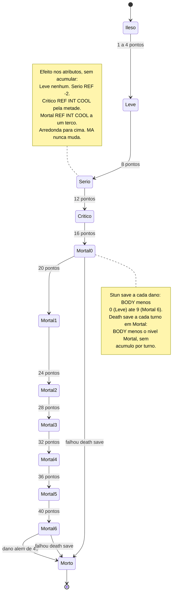
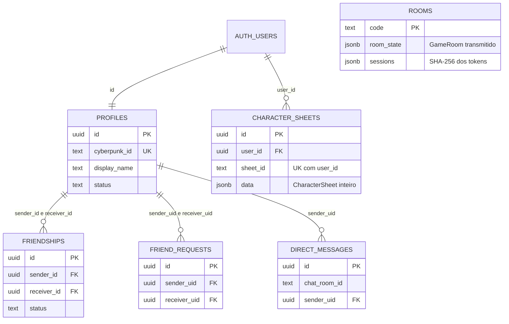

# Arquitetura — diagramas do sistema

> Documento vivo. Cada fase de construção do [`PLANO_MESTRE.md`](./PLANO_MESTRE.md) que muda a forma
> do sistema **atualiza o diagrama afetado antes de fechar** — é parte do portão de segurança.
>
> **Um diagrama desenhado antes do trabalho é especificação. Desenhado depois, é documentação que
> apodrece.** Por isso os diagramas de regra (pipeline de dano, máquina de ferimento) existem aqui
> antes das Fases C e D: eles são o alvo, não o relatório.

## Convenção

Mermaid, com `flowchart` e `subgraph` para os níveis de contexto e contêiner do
[modelo C4](https://c4model.com/). **Não usamos a sintaxe `C4Context` do Mermaid**: ela é
experimental e o renderizador do GitHub não a suporta — os diagramas não apareceriam no repositório,
que é justamente onde precisam ser lidos.

Estilo mínimo e sem preenchimento de cor, para renderizar legível tanto no tema claro quanto no
escuro do GitHub.

---

## Contêineres e fronteiras de confiança

O diagrama que faltava. **O SEC-05 existiu porque ninguém tinha desenhado onde fica a fronteira** —
a ficha atravessava do navegador para o motor de regras sem nada no caminho.

### As três regras que este desenho expressa

1. **Nada que vem do navegador é confiável** — nem a ficha, nem o `peerId`, nem o `woundLevel`, nem o
   binário Yjs. Toda seta que cruza para a zona confiável passa por `VAL` antes de chegar em `RULES`.
   *A caixa `VAL` existe desde a Fase B (B.2): `src/rules/sheetSchema.ts`, aplicada dentro do
   `roomManager` para cobrir todo caminho que escreve ficha, não só a rota HTTP.* **O binário Yjs
   ainda não passa por ela** — continua com try/catch apenas, e é item da Fase J.
2. **O autor de toda ação é derivado do `sessionToken`**, nunca de um campo do corpo.
3. **`service_role` e chave de IA não cruzam a fronteira** — vivem só no processo do servidor, jamais
   em variável `VITE_`.

*A caixa `RULES` existe de fato desde a Fase C:* `src/rules/` (tabelas do livro, motor de dados,
atributos derivados, ataque). **O navegador roda o mesmo código** no rolador pessoal da ficha — mas
isso não atravessa a fronteira: na mesa, só vale o que o servidor rola, com o RNG dele e a ficha que
ele saneou. Compartilhar o código é o que garante a paridade (C.10), não confiança no cliente.

### O que o desenho revelou sobre a leitura

O desenho tornava óbvio, de um jeito que 1.000 linhas de `server.ts` não tornavam, que as setas de
**leitura** (`GET /api/rooms/:code`, `/stream`) não passavam por verificação de sessão — o SEC-02.

**Fechado na Fase B (B.3), em 03/09/2026.** A leitura de sala responde em três casos (sem token →
recorte público; token válido → sala completa; token inválido → 401) e o stream exige sessão pela
query, porque `EventSource` não permite header customizado.

---

## Ciclo de vida de sala e sessão

Especificação do coletor que a **Fase B** precisa construir (SEC-04).

**Implementado na Fase B (B.5 — SEC-04), em 03/09/2026.** A transição `Ociosa --> Encerrada` era o
buraco: uma mesa que todo mundo fechou a aba nunca morria, e as sessões dela iam junto.

Dois limiares, porque são perguntas diferentes:

| Transição | Env | Padrão | Pergunta |
|---|---|---|---|
| `Ativa --> Ociosa` | `ROOM_OFFLINE_TIMEOUT_MS` | 60 s | o jogador ainda está aí? |
| `Ociosa --> Encerrada` | `ROOM_ABANDONED_TIMEOUT_MS` | 24 h | a mesa foi abandonada? |

O coletor (`collectAbandonedRooms`, varrido de 15 em 15 min) cumpre os **três** passos da nota de
`Encerrada`. Fazer só o primeiro deixaria uma linha órfã que ressuscitaria a sala no próximo boot.

As 24 h são conservadoras de propósito: o risco não é simétrico. Recolher tarde custa uma linha a
mais no banco por mais um dia; recolher cedo apaga a mesa de alguém, e o delete é irreversível.

---

## Pipeline de dano FNFF

**Este diagrama é a especificação da Fase D** (RUL-04). Depois da Fase C, as peças existem e seguem o
livro — local de impacto por tabela (`HIT_LOCATIONS`), `btmFromBody`, efeito de ferimento
(`applyWoundEffect`), stun e death save — mas **ainda não se conectam**: o dano sai como texto no
chat e o `woundLevel` é clicado à mão. Ligar é a D.1.

*Conferido contra o livro na C.9 (25/09/2026) — fontes em
[`CONFERENCIA_CP2020.md`](./CONFERENCIA_CP2020.md#dano--a-ordem-do-pipeline-para-a-fase-d).*

O que a conferência fixou, e o que ficou para o dono:

- **SP antes do ×2** — a cabeça dobra o dano **que passou** da armadura. Confirmado.
- **BTM nunca leva o dano a zero** — mínimo 1 ponto, se a armadura foi vencida. Confirmado.
- **×2 antes ou depois do BTM?** O livro **não é explícito**. O desenho segue a leitura mais comum
  (dobra, depois BTM). **Decisão do dono antes da D.1**, com o livro na mão.
- **Não há modificador cumulativo por turno no death save** — o nó antigo dizia "com modificador
  cumulativo", que é do Cyberpunk RED. É BODY menos o nível Mortal, a cada turno.
- Também da Fase D, e fora do desenho de propósito: **penetração escalonada** (cada acerto que passa
  tira 1 do SP daquele ponto) e **perda de membro** (mais de 8 pontos num membro de uma vez; na
  cabeça, morte).

---

## Máquina de estados do ferimento

**Implementada na Fase C** (C.5 e C.7) — a trilha está em `WOUND_TRACK`
([`src/rules/tables.ts`](../src/rules/tables.ts)), com o nome, o modificador de stun, o nível
Mortal e o efeito de cada caixa. Onze estados: `woundLevel` 0 é ileso e 1–10 são as dez caixas de
quatro pontos.

> **Morto não é um `woundLevel`.** O modelo tem 0–10, e o 10 é Mortal 6 — **ainda vivo**. Até a
> Fase C o app tratava o 10 como morte e desligava o death save justo ali (`isDead`, hoje
> `isLastWoundBox`). Representar a morte como estado é da Fase D, junto com o dano que a causa.

---

## Schema do Supabase

Desenhado na Fase C porque o **gatilho escrito disparou**: "quando o schema mudar" — a migration
`0007` (Fase B) acrescentou `rooms.sessions`. Só as colunas que carregam relação ou decisão; o
resto está nas migrations.

- **`rooms` não tem dono nem chave estrangeira** — é estado do servidor, não do usuário. RLS
  ligada com **zero policies**: só a service role do servidor lê e escreve (`0006`).
- **`sessions` é coluna própria, fora do `room_state`** (`0007`, B.4): o `room_state` é o objeto
  transmitido a toda a mesa, e o token de sessão ali dentro vazaria para todos.
- As outras cinco tabelas têm RLS com policies por usuário (`0001`–`0003`), cobertas pelos 56 testes
  de `scripts/test-rls.mjs`. `profiles.email` saiu na `0004`.
- **A Fase C não mexeu no schema.** A `CharacterSheet` mudou de regra, não de forma: o
  `currentStats` continua no `data` por compatibilidade, e o servidor o recalcula.

---

## Diagramas adiados

> **Saiu desta lista na Fase C:** o ER do schema — o gatilho ("quando o schema mudar") disparou
> com a `0007` da Fase B, e o desenho está em [Schema do Supabase](#schema-do-supabase).

Aplicando o [filtro de necessidade](./PLANO_MESTRE.md#-filtro-de-necessidade) aos próprios diagramas
— porque desenho sem sintoma também é overengineering.

| Diagrama | Veredito | Gatilho |
|---|---|---|
| Sequência do handshake (join → token → upgrade → rolagem) | **ADIAR** | Quando a Fase H precisar depurar reconexão. O [`PROTOCOLO_MULTIPLAYER.md`](./PROTOCOLO_MULTIPLAYER.md) já descreve o fluxo em prosa, e ninguém se perdeu nele ainda |
| Reconexão e last-write-wins por `updatedAt` | **ADIAR** | Quando a Fase H achar um bug de convergência de ficha |
| Camadas de token visual | **ADIAR** | Se a Fase F.2 se mostrar confusa na prática. A tabela de tokens na ADR 0006 provavelmente basta |
