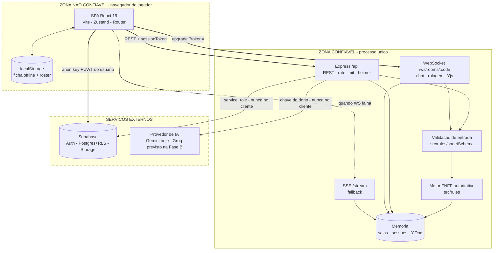
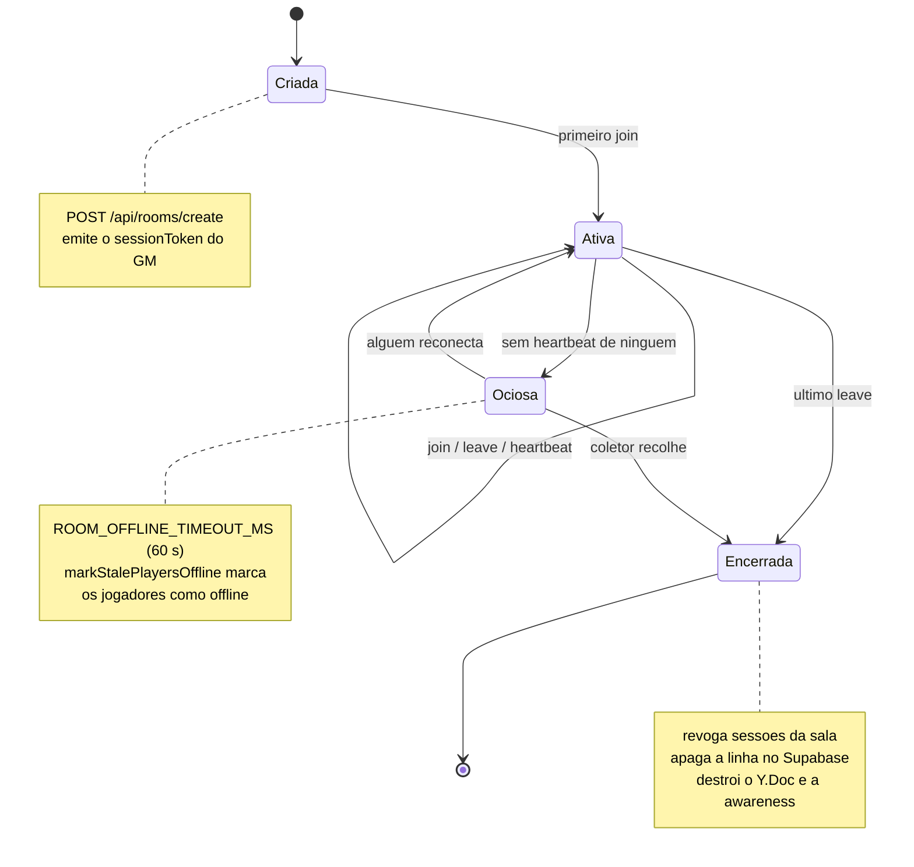
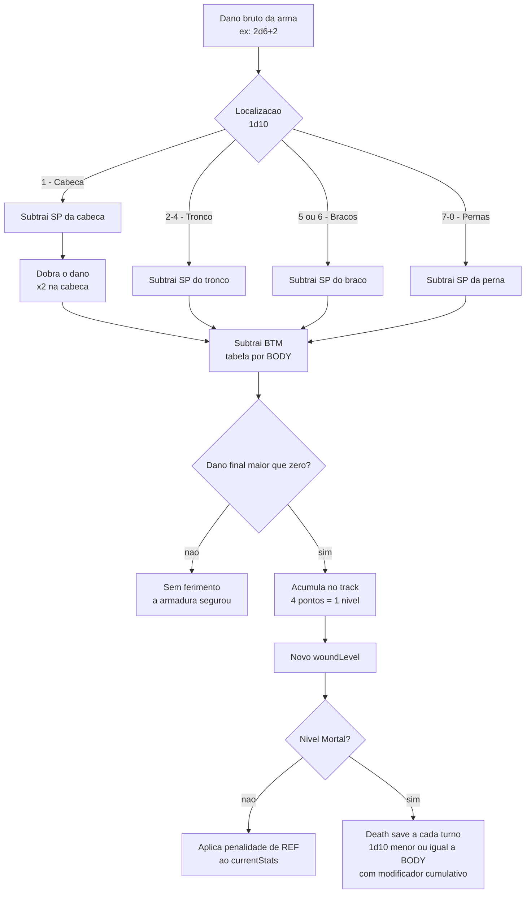
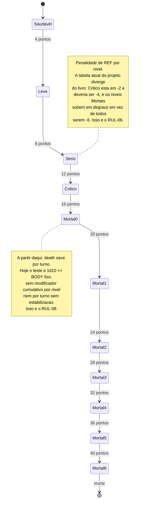

# Arquitetura — diagramas do sistema

> Documento vivo. Cada fase de construção do [`PLANO_MESTRE.md`](./PLANO_MESTRE.md) que muda a forma
> do sistema **atualiza o diagrama afetado antes de fechar** — é parte do portão de segurança.
>
> **Um diagrama desenhado antes do trabalho é especificação. Desenhado depois, é documentação que
> apodrece.** Por isso os diagramas de regra (pipeline de dano, máquina de ferimento) existem aqui
> antes das Fases C e D: eles são o alvo, não o relatório.

## Convenção

Mermaid, com `flowchart` e `subgraph` para os níveis de contexto e contêiner do
[modelo C4](https://c4model.com/). **Não usamos a sintaxe `C4Context` do Mermaid**: ela é
experimental e o renderizador do GitHub não a suporta — os diagramas não apareceriam no repositório,
que é justamente onde precisam ser lidos.

Estilo mínimo e sem preenchimento de cor, para renderizar legível tanto no tema claro quanto no
escuro do GitHub.

---

## Contêineres e fronteiras de confiança

O diagrama que faltava. **O SEC-05 existiu porque ninguém tinha desenhado onde fica a fronteira** —
a ficha atravessava do navegador para o motor de regras sem nada no caminho.

### As três regras que este desenho expressa

1. **Nada que vem do navegador é confiável** — nem a ficha, nem o `peerId`, nem o `woundLevel`, nem o
   binário Yjs. Toda seta que cruza para a zona confiável passa por `VAL` antes de chegar em `RULES`.
   *A caixa `VAL` existe desde a Fase B (B.2): `src/rules/sheetSchema.ts`, aplicada dentro do
   `roomManager` para cobrir todo caminho que escreve ficha, não só a rota HTTP.* **O binário Yjs
   ainda não passa por ela** — continua com try/catch apenas, e é item da Fase J.
2. **O autor de toda ação é derivado do `sessionToken`**, nunca de um campo do corpo.
3. **`service_role` e chave de IA não cruzam a fronteira** — vivem só no processo do servidor, jamais
   em variável `VITE_`.

### O que o desenho revelou sobre a leitura

O desenho tornava óbvio, de um jeito que 1.000 linhas de `server.ts` não tornavam, que as setas de
**leitura** (`GET /api/rooms/:code`, `/stream`) não passavam por verificação de sessão — o SEC-02.

**Fechado na Fase B (B.3), em 03/09/2026.** A leitura de sala responde em três casos (sem token →
recorte público; token válido → sala completa; token inválido → 401) e o stream exige sessão pela
query, porque `EventSource` não permite header customizado.

---

## Ciclo de vida de sala e sessão

Especificação do coletor que a **Fase B** precisa construir (SEC-04).

**Implementado na Fase B (B.5 — SEC-04), em 03/09/2026.** A transição `Ociosa --> Encerrada` era o
buraco: uma mesa que todo mundo fechou a aba nunca morria, e as sessões dela iam junto.

Dois limiares, porque são perguntas diferentes:

| Transição | Env | Padrão | Pergunta |
|---|---|---|---|
| `Ativa --> Ociosa` | `ROOM_OFFLINE_TIMEOUT_MS` | 60 s | o jogador ainda está aí? |
| `Ociosa --> Encerrada` | `ROOM_ABANDONED_TIMEOUT_MS` | 24 h | a mesa foi abandonada? |

O coletor (`collectAbandonedRooms`, varrido de 15 em 15 min) cumpre os **três** passos da nota de
`Encerrada`. Fazer só o primeiro deixaria uma linha órfã que ressuscitaria a sala no próximo boot.

As 24 h são conservadoras de propósito: o risco não é simétrico. Recolher tarde custa uma linha a
mais no banco por mais um dia; recolher cedo apaga a mesa de alguém, e o delete é irreversível.

---

## Pipeline de dano FNFF

**Este diagrama é a especificação da Fase D**, e o motivo de ele existir antes é o RUL-04: hoje as
peças estão todas implementadas (`armorSpAt`, `btmFromBody`, `clampWoundLevel`) e **nenhuma se
conecta** — `rollDamage` imprime o local como texto e o `woundLevel` é clicado à mão.

> **A ordem importa e precisa ser confirmada no livro.** A sequência desenhada é
> **SP → multiplicador de localização → BTM**. Trocar a ordem muda o resultado: aplicar o BTM antes de
> dobrar a cabeça produz números diferentes. A decisão 2 do plano é **fidelidade estrita**, então a
> C.9 confere isso contra o texto original antes de a Fase D codificar — este desenho é a hipótese de
> trabalho, não a autoridade.

---

## Máquina de estados do ferimento

Especificação para a **Fase C** (RUL-06, RUL-08). Onze estados, quatro pontos de dano cada.

---

## Diagramas adiados

Aplicando o [filtro de necessidade](./PLANO_MESTRE.md#-filtro-de-necessidade) aos próprios diagramas
— porque desenho sem sintoma também é overengineering.

| Diagrama | Veredito | Gatilho |
|---|---|---|
| Sequência do handshake (join → token → upgrade → rolagem) | **ADIAR** | Quando a Fase H precisar depurar reconexão. O [`PROTOCOLO_MULTIPLAYER.md`](./PROTOCOLO_MULTIPLAYER.md) já descreve o fluxo em prosa, e ninguém se perdeu nele ainda |
| ER do schema Supabase | **ADIAR** | Quando o schema mudar. Hoje as migrations 0001–0006 e a suíte de RLS documentam melhor que um desenho |
| Reconexão e last-write-wins por `updatedAt` | **ADIAR** | Quando a Fase H achar um bug de convergência de ficha |
| Camadas de token visual | **ADIAR** | Se a Fase F.2 se mostrar confusa na prática. A tabela de tokens na ADR 0006 provavelmente basta |
